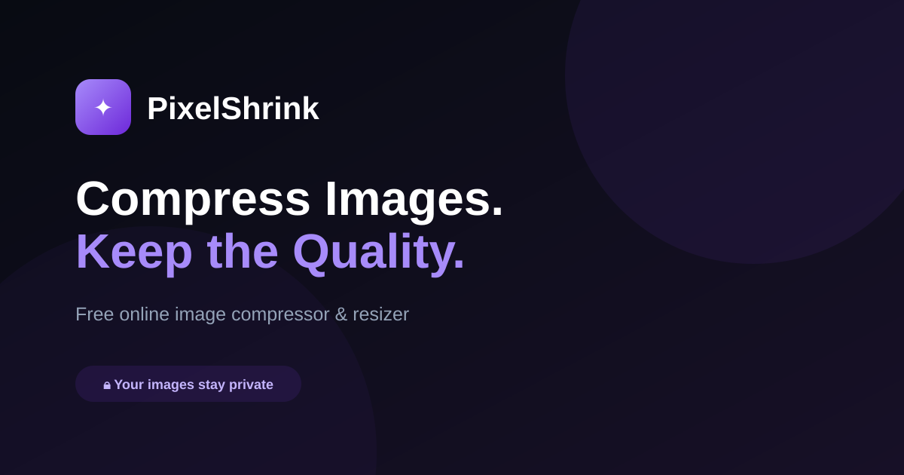

# PixelShrink



**PixelShrink** is a free, browser-based image compressor and resizer that lets you optimize JPG, PNG, and WebP images without uploading them to a server.

**Live website:** https://pixelshrinkapp.web.app/

## Features

- Compress images directly in the browser
- Resize images with custom width and height
- Keep the original aspect ratio when resizing
- Adjust image quality
- Export as JPEG, WebP, or PNG
- Drag-and-drop image selection
- Preview the compressed result
- See file-size reduction and savings
- Supports images up to 50 MB
- No image upload required
- Works on modern desktop and mobile browsers

## Privacy

PixelShrink is designed to process images locally in the browser.

Images are loaded into the browser, resized with the HTML Canvas API, and converted to the selected output format. The application does not require users to upload their images to a remote image-processing server.

This makes PixelShrink useful for users who want to reduce image file size while keeping their images on their own device.

## How It Works

1. Select an image or drag it into the upload area.
2. Set the desired width and height.
3. Choose whether to keep the aspect ratio locked.
4. Adjust the compression quality.
5. Select JPEG, WebP, or PNG output.
6. Click **Resize & compress**.
7. Preview and download the optimized image.

## Supported Formats

### Input

PixelShrink accepts browser-supported image formats through the image file picker.

### Output

- JPEG
- WebP
- PNG

## Technology

PixelShrink is built with lightweight web technologies:

- HTML5
- CSS3
- JavaScript
- HTML Canvas API
- Font Awesome
- Google Fonts
- Firebase Hosting

No backend image-processing service is required for the core compression workflow.

## Project Structure

```text
pixelshrink/
├── index.html
├── style.css
├── script.js
├── og-image.svg
├── robots.txt
├── sitemap.xml
└── firebase.json
```

## Running Locally

Clone the repository:

```bash
git clone https://github.com/sadudoy/pixel-shrink-image-compressor.git
```

Enter the project directory:

```bash
cd pixelshrink
```

Because PixelShrink is a client-side web application, you can serve the project with any local static web server.

For example, with VS Code, install the **Live Server** extension and open `index.html` with Live Server.

Then open the local URL shown by your development server.

## Firebase Hosting

PixelShrink is hosted using Firebase Hosting.

If you already have the Firebase CLI installed and authenticated:

```bash
firebase login
```

Initialize Firebase Hosting in the project if needed:

```bash
firebase init hosting
```

Then deploy:

```bash
firebase deploy
```

After deployment, the application can be accessed from your Firebase Hosting URL.


## Screenshots & Social Preview

`og-image.svg` is used as the social sharing preview image and provides a simple PixelShrink visual identity without requiring an external logo asset.

You can replace it later with a custom branded image or screenshot.

## Roadmap

Potential future improvements include:

- Batch image compression
- Additional resize presets
- More advanced image optimization controls


## Contributing

Contributions, suggestions, and bug reports are welcome.

1. Fork the repository.
2. Create a feature branch.
3. Make your changes.
4. Test the application locally.
5. Commit your changes.
6. Open a pull request.

## License

Add your preferred open-source license here before publishing the repository as an open-source project.

---

**PixelShrink** — compress images, reduce file size, and resize images directly in your browser.

---
### Author
Sad Ibna Forid

Bangladesh Army University of Science and Technology, Sadipur